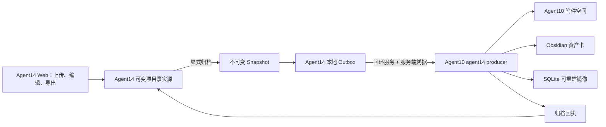

# Agent14 → Agent10 不可变快照归档集成设计

- 日期：2026-08-19
- 状态：设计方向已获 TZ 确认，Agent10/Agent14 一致性审查通过；最小垂直切片已实施并通过双方回归测试
- 业务生产者：`/Users/tristanzh/agent/agent14-ppt2html`
- 归档与治理方：`/Users/tristanzh/agent/agent10-asset-library`
- Web 发布方：`/Users/tristanzh/agent/web`
- 外部数据传输：无；所有数据只在本机受控路径和回环服务间流动
- 本轮实施：Agent14 不可变 snapshot + Outbox + 同源状态 API、runtime-root writer lock；Agent10 `agent14-archive:v1` 独立校验适配器、请求合同校验与显式 `AGENT14_SNAPSHOT_ROOT` producer 启用
- 本轮未启用：真实 Agent10 传输 worker、附件复制/阶段日志、Web 入口、Production Vault/Obsidian 接收；当前 producer draft 的附件引用仍是快照相对路径，不能投影为“附件已归档”

## 1. 结论

Agent14 不把数据库、工作目录或 Obsidian 写权限直接交给 Agent10。双方通过一个版本化、不可变、可校验的本地快照合同集成：

> Agent14 是可变工作项目的事实源；Agent10 是已接收归档快照的事实源。

用户继续在 Agent14 完成上传、转换、编辑和导出。只有用户显式点击“归档到资产库”后，Agent14 才冻结当前导出 revision，生成不可变快照并投递到本地 Outbox。Agent10 通过受控生产者接口验证、接收和归档该快照，写入 Obsidian 人类可读资产卡、Agent10 管理的附件空间和 SQLite 可重建查询镜像。

Agent10 不参与 Agent14 的上传、转换、编辑、页面渲染或 revision 合并。Agent10 不可用时，Agent14 仍可正常编辑和导出。

## 2. 第一性原理与不变量

### 2.1 用户价值

接入只服务三个长期目标：

1. 用户完成的文档成果不会只停留在易清理的运行目录中。
2. 归档内容具备完整来源、版本、哈希和转换质量信息，可供后续检索、再处理和新增功能使用。
3. 资产库故障、停机或升级不能破坏 Agent14 当前 Web 工作流。

### 2.2 系统不变量

- Agent14 的当前项目、Block、revision 和工作副本只由 Agent14 修改。
- Agent10 接收的每个快照一旦冻结便不可修改；新 revision 产生新快照。
- 浏览器只访问同源 `/api/agent14/*`，不直接访问 Agent10，也不接触 Agent10 控制凭据。
- Agent14 不能提交最终 `asset_id`；最终资产标识由 Agent10 分配。
- 相同 operation key 和相同快照内容必须幂等复用，不更新、不重复创建。
- 附件、Obsidian 资产卡和 SQLite 镜像未达到完整接收合同前，不得显示“已归档”。
- Agent10 不能反向修改、删除或恢复 Agent14 工作项目。
- 没有外部模型、云存储或第三方服务参与该数据链路。

## 3. 方案比较

| 方案 | 结论 | 原因 |
|---|---|---|
| Agent14 直接写 Agent10 SQLite 或 Obsidian | 拒绝 | 形成双写、绕过治理、产生事实源竞争 |
| Agent14 导出时同步等待 Agent10 | 不采用 | 把本地导出与跨系统持久化耦合，扩大故障面 |
| 不可变快照 + Outbox + Agent10 受控接收 | 采用 | 在线功能隔离、可重试、可审计、可幂等 |

## 4. 权责边界

### 4.1 Agent14 拥有

- PPT/PDF 文件输入、格式归一化、解析和 OCR；
- 页面、Block、坐标、可编辑文字和转换警告；
- 原始文件、当前工作副本和 revision；
- HTML、Markdown、manifest 和 ZIP 导出；
- 显式归档操作的用户界面；
- 不可变快照生成、文件哈希、本地 Outbox 和投递回执；
- “本地保存”“HTML 已导出”“资产已归档”三个独立状态。

### 4.2 Agent10 拥有

- `agent14` 生产者的 allowlist、认证和合同版本；
- 快照路径、manifest、文件清单、文件哈希、容量和符号链接校验；
- 最终 `asset_id`、资产类型、Obsidian 路径和附件路径；
- 附件持久化、Obsidian 资产卡、SQLite 镜像和操作日志；
- 幂等冲突、部分失败、修复和最终归档回执；
- 归档资产的读取、查询、治理和后续知识提升边界。

### 4.3 共享 Web 拥有

- `/agent14` 页面和 `/api/agent14/*` 同源代理；
- Agent14 路由范围内的归档按钮和状态展示；
- Agent14 后端不可用时的产品化错误。

共享 Web 不代理原始 Agent10 控制响应，不持有 Agent10 业务逻辑，不读取快照文件，也不启动任何后端。

### 4.4 明确禁止

- Agent10 解析 PPT/PDF、执行 OCR 或渲染 HTML；
- Agent10 合并 Agent14 revision 或修改 Block；
- Agent14 直接写 Agent10 SQLite；
- Agent14 和 Agent10 同时直接写同一 Obsidian 目标；
- 页面加载、项目读取、保存文字或导出 HTML 自动触发归档；
- 在浏览器、URL、日志或 API 响应中暴露 token、绝对 Vault 路径或原始异常；
- 未经用户显式选择把原始 PPT/PDF 加入归档快照。

## 5. 架构与数据流



标准流程：

1. 用户在 Agent14 编辑并保存当前项目。
2. 用户导出 HTML 包；导出仍是独立的本地动作。
3. 页面显示“归档到资产库”，用户显式点击。
4. Agent14 验证当前 revision 已存在对应导出包，再从该 revision 的工作产物冻结快照，在同一文件系统内完成 staging、哈希和原子发布，生成不可变快照与 Outbox 记录。
5. Agent14 后端使用本地配置的 Agent10 地址和控制凭据投递快照；浏览器不接触这些信息。
6. Agent10 完成合同验证、幂等判断、附件接收、资产卡发布和镜像更新。
7. Agent10 返回最小归档回执；Agent14 将回执与 snapshot ID 关联并更新独立归档状态。

## 6. Agent14 本地快照模型

建议在每个项目下增加：

```text
.runtime/projects/<document-id>/
  archive/
    snapshots/
      snap-r<revision>-<hash12>/
        archive-manifest.json
        payload/
          index.html
          content.md
          manifest.json
          assets/
          source/                 # 可选
    outbox/
      snap-r<revision>-<hash12>.json
    receipts/
      snap-r<revision>-<hash12>.json
```

规则：

- `snapshots/` 中的目录发布后不可修改。
- 快照始终从已读取并校验的 current revision 工作产物复制到同父目录 staging；校验完成后原子 rename 为最终目录。现有可重复生成的 export ZIP 不是归档快照，也不能直接改名充当快照。
- 只有 `expectedRevision` 等于当前项目 revision，且同 revision 的 HTML 导出包已经存在时，才允许生成归档快照；编辑产生新 revision 后必须重新导出。
- 快照生成器必须汇总 document、page 和 block 三级 warning codes，不能只读取顶层 `document.warnings`。
- Outbox 只保存投递状态、重试信息和快照相对路径，不复制正文。
- receipt 只保存 Agent10 返回的最小结果，不保存控制凭据、Vault 绝对路径或原始异常。
- Outbox 和 receipt 的创建、更新不得修改项目 revision、work manifest、当前 HTML/Markdown 或既有导出结果。
- 同一 revision 内容未变时复用已有快照；内容变化必须形成新的 revision 和快照。
- Agent14 项目不能因为 Outbox 或 receipt 损坏而无法打开、编辑或导出。

### 6.1 并发一致性

Agent14 当前 `work/` 是可变目录。为防止快照混入两个 revision 的 HTML、Markdown、manifest 或 assets，`ProjectStore` 必须建立以下写入合同：

- 同一 runtime root 只允许一个 Agent14 writer 进程；第二个 writer 启动时失败关闭。
- 每个 document ID 有一个项目级写 mutex，`updateBlock`、`writeExport` 和 `createArchiveSnapshot` 必须使用同一 mutex。
- `createArchiveSnapshot` 在锁内依次执行：读取 project/manifest、校验 expected revision、校验同 revision export、复制 `work/` 到 staging、对 staging 的实际字节计算哈希、再次确认 revision、原子发布 snapshot、持久化 Outbox。
- 任何复制、哈希、revision 复核或 Outbox 写入失败都只留下不可见 staging；不得发布混合快照。
- mutex 只保护同一项目的本地一致性；快照和 Outbox 发布完成便释放，随后 Agent10 传输完全在锁外进行。
- 其他项目的上传、编辑和导出不等待该 mutex。同一项目在短暂 `snapshot_building` 期间的写请求返回明确的忙碌状态或在同一有界队列中串行执行，不能并发修改 `work/`。

## 7. 快照机器合同

### 7.1 文件集合

必须包含：

- `archive-manifest.json`
- `payload/index.html`
- `payload/content.md`
- `payload/manifest.json`
- `payload/assets/**`，仅在转换产物实际存在资源时包含

可选包含：

- `payload/source/<safe-source-file>`，仅当用户勾选“随档案保留原文件”时包含

不允许包含：

- 绝对路径；
- 符号链接、硬链接或设备文件；
- 未列入 `archive-manifest.json` 的额外文件；
- token、Cookie、Vault 配置或运行日志；
- 构建缓存、临时文件和导出历史副本。

### 7.2 `archive-manifest.json`

第一版合同标识为 `agent14-archive:v1`：

```json
{
  "contractVersion": "agent14-archive:v1",
  "snapshotId": "snap-r2-2f56d7b91e40",
  "documentId": "doc-example",
  "snapshotRevision": 2,
  "operationKey": "agent14:doc-example:r2:sha256:<bundle-hash>",
  "createdAt": "2026-08-19T12:00:00+08:00",
  "source": {
    "fileName": "example.pptx",
    "mediaType": "application/vnd.openxmlformats-officedocument.presentationml.presentation",
    "sha256": "sha256:<source-hash>",
    "originalIncluded": false
  },
  "document": {
    "pageCount": 16,
    "warningCodes": [],
    "contentSha256": "sha256:<content-hash>",
    "bundleSha256": "sha256:<bundle-hash>"
  },
  "files": [
    {
      "path": "payload/index.html",
      "role": "editable_html",
      "mediaType": "text/html",
      "bytes": 12345,
      "sha256": "sha256:<file-hash>"
    }
  ]
}
```

要求：

- 所有时间为带时区的 ISO 8601。
- 所有路径为 POSIX 相对路径，不能包含 `..`、空段或反斜杠。
- `files` 只列出 `payload/` 下的文件；`archive-manifest.json` 不列入 `files`，也不参与自身 bundle hash。V1 不另设 manifest hash。
- `files` 按 path 的 UTF-8 字节序排序后参与 bundle hash 计算；warning codes 去重后按同一规则排序。
- 第一阶段先构造 `manifestCore`，它只包含 `contractVersion`、`documentId`、`snapshotRevision`、`source`、`document.pageCount/warningCodes/contentSha256` 和 `files`。
- `contentSha256` 是快照中 `payload/content.md` 最终文件的精确字节 SHA-256。Agent14 在快照 staging 时将 Markdown 规范化为有效 UTF-8、无 BOM、LF 换行并以单个末尾换行结束，然后写入文件并对这些实际字节计算；Agent10 对接收到的同一文件字节独立复算。
- `manifestCore` 使用 UTF-8、无 BOM、对象键递归字节序排序、无无意义空白的 canonical JSON 编码；数组保持合同定义的顺序，其中 `files` 和 warning codes 已预先排序。
- bundle hash 等于 canonical `manifestCore` 字节的 SHA-256。
- `createdAt`、`snapshotId`、`operationKey`、临时目录、绝对路径和运行环境信息不参与 bundle hash；因此同 revision、同内容重复生成必须得到相同 bundle hash。
- 第二阶段才由 bundle hash 派生 `snapshotId` 和 `operationKey`，再与 `bundleSha256`、`createdAt`、原始 `manifestCore` 一起组成最终 `archive-manifest.json`，避免循环依赖。
- operation key 格式为 `agent14:<documentId>:r<revision>:sha256:<bundleHash>`。
- Agent10 必须用同一 canonical 规则重新计算所有文件哈希和 bundle hash，不能信任生产者声明。

### 7.3 资产语义映射

Agent10 的 Agent14 adapter 生成普通 draft，至少映射为：

| 字段 | 值或规则 |
|---|---|
| `agent_id` | `agent14` |
| `workflow_id` | `ppt2html_archive` |
| `asset_type` | `agent14_document_snapshot` |
| `status` | `active` |
| `knowledge_status` | `not_indexed` |
| `source_status` | 有 OCR/提取复核警告时为 `uncertain`，否则为 `grounded` |
| `sensitivity` | 默认 `restricted` |
| `source_asset_path` | Agent10 认可的快照逻辑标识，不在人类可见输出中暴露绝对路径 |
| `source_content_hash` | 快照 bundle SHA-256 |
| `body_markdown` | `content.md` 加归档摘要、质量提示和附件相对链接 |

`file_refs` 记录 HTML、manifest、assets 和可选原文件的 Agent10 管理路径。原文件未包含时，仍记录源文件名、媒体类型和 source SHA-256，但不能伪造可用路径。

## 8. API 合同

### 8.1 浏览器 → Agent14

建议新增：

| 方法 | 路径 | 作用 |
|---|---|---|
| `POST` | `/api/agent14/projects/:documentId/archive-snapshots` | 对指定 current revision 生成不可变快照并进入 Outbox |
| `GET` | `/api/agent14/projects/:documentId/archive-snapshots` | 返回该项目归档状态摘要 |
| `POST` | `/api/agent14/projects/:documentId/archive-snapshots/:snapshotId/retry` | 用户显式重试一个可重试失败 |

创建请求只接受：

```json
{
  "expectedRevision": 2,
  "includeOriginal": false
}
```

operation key、snapshot ID、文件路径和哈希均由 Agent14 后端生成，浏览器不能指定。

硬响应合同：

- `POST archive-snapshots` 只等待本地 snapshot 原子发布和 Outbox 记录持久化，不等待 Agent10。
- 完成上述本地步骤后立即返回 `202`，正文包含 `snapshotId`、`snapshotStatus: ready` 和 `deliveryStatus: queued`。
- 独立传输 worker 消费 Outbox；worker 的连接、退避和 Agent10 响应不占用上传、编辑、保存或导出请求。
- `GET` 状态和显式 retry 只能读取或复用既有 snapshot/operation key，不能重新冻结 work 目录。

Agent14 API 使用以下统一响应字段：

```json
{
  "snapshotId": "snap-r2-2f56d7b91e40",
  "revision": 2,
  "snapshotStatus": "ready",
  "deliveryStatus": "queued",
  "archiveStatus": "pending",
  "retryable": false,
  "assetId": null,
  "lastErrorCode": null,
  "updatedAt": "2026-08-19T12:00:00+08:00"
}
```

- create 和 retry 成功排队均返回 `202` 加上述单项对象；retry 返回 `deliveryStatus: queued`。
- GET 返回 `{ "documentId": "...", "snapshots": [...] }`，按 revision 降序、snapshot ID 升序稳定排列。
- `snapshotStatus` 只取 `ready` 或 `invalid`；快照尚在构建时不会暴露为可查询记录，快照目录缺失或完整性不可判定时为 `invalid`。

枚举与投影：

| `deliveryStatus` | `archiveStatus` | `retryable` | 含义 |
|---|---|---:|---|
| `queued` / `submitting` | `pending` | `false` | 已有完整本地快照，正在受控投递 |
| `retry_pending` | `failed` | `true` | 临时失败或进程中断，可显式重试 |
| `repair_pending` | `pending` | `false` | Agent10 已有部分持久化事实，等待 Agent10 恢复同一 operation |
| `archived` | `archived` | `false` | 已收到完整归档回执 |
| `rejected` | `failed` | `false` | 合同、哈希、路径、权限或冲突错误，需要新快照 |
| `unknown` | `unknown` | `false` | 本地 Outbox/receipt 不完整或不可判定，不得自动投递 |

错误码：

| HTTP | code | 场景 |
|---:|---|---|
| `400` | `INVALID_ARCHIVE_REQUEST` | revision 或 includeOriginal 类型无效 |
| `404` | `SNAPSHOT_NOT_FOUND` | 查询或重试不存在的 snapshot |
| `409` | `REVISION_CONFLICT` | expected revision 不是 current revision |
| `409` | `EXPORT_NOT_READY` | current revision 尚无对应导出 |
| `409` | `SNAPSHOT_BUILDING` | 同一项目已有快照写锁 |
| `409` | `SNAPSHOT_NOT_RETRYABLE` | 对 archived/rejected/unknown 状态请求重试 |
| `409` | `ARCHIVE_MODE_DISABLED` | 当前处于 legacy Obsidian 兼容模式 |
| `500` | `SNAPSHOT_BUILD_FAILED` | 本地 staging、哈希或原子发布失败 |

重启恢复规则：

- 已有 `archived` receipt 时以 receipt 为准，不再投递。
- 持久状态停在 `submitting` 而没有终态 receipt 时，启动后投影为 `retry_pending`，`lastErrorCode: DELIVERY_INTERRUPTED`；仅显式 retry 才重新入队。
- Outbox 或 receipt 缺失、损坏或互相矛盾时投影为 `unknown`，不自动修复、不影响项目打开和导出。
- GET 只读取本地状态；需要查询 Agent10 `repair_pending` 进度时使用单独的显式刷新动作，该动作只调用 Agent10 的只读 operation GET。

### 8.2 Agent14 后端 → Agent10

受控接口：

```text
POST /api/agent10/producers/agent14/assets
GET  /api/agent10/producers/agent14/operations/:operationKey
```

这是 Agent10 HTTP 服务的唯一外部合同。Agent10 内部可以继续把 `/api/agent10/*` 重写为 `/api/asset-library/*`，但内部前缀不得出现在 Agent14 配置或跨系统测试中。

提交体只包含：

```json
{
  "contract_version": "agent14-archive:v1",
  "operation_key": "agent14:doc-example:r2:sha256:<bundle-hash>",
  "source_asset_path": "/approved/agent14/projects/doc-example/archive/snapshots/snap-r2-2f56d7b91e40"
}
```

绝对路径只存在于本地 server-to-server 请求中，必须指向 `archive/snapshots/<snapshotId>` 的真实不可变快照目录，并位于 Agent10 配置的 Agent14 snapshot root 内；不能指向只保存状态的 `outbox/`。Agent10 需要同时执行 realpath containment、符号链接拒绝和 manifest 文件集校验。

成功回执：

```json
{
  "operation_key": "agent14:doc-example:r2:sha256:<bundle-hash>",
  "archive_status": "archived",
  "asset_id": "ast_YYYYMMDD_<8hex>",
  "mode": "rest",
  "mirror_status": "upserted"
}
```

首次写入沿用 Agent10 当前 writer 的 `rest` 或受控 `fallback` 模式；重复提交同一 operation key 和相同 bundle 时返回 `mode: idempotent_reuse`。同一 operation key 指向不同 bundle 必须返回冲突，不能更新旧资产。

operation GET 是只读查询，已知 operation 固定返回：

```json
{
  "operation_key": "agent14:doc-example:r2:sha256:<bundle-hash>",
  "stage": "archived",
  "archive_status": "archived",
  "asset_id": "ast_YYYYMMDD_<8hex>",
  "mode": "rest",
  "mirror_status": "upserted",
  "retryable": false,
  "last_error_code": null,
  "updated_at": "2026-08-19T12:00:00+08:00"
}
```

字段合同：

- `stage` 只取 `validated`、`attachments_staged`、`attachments_committed`、`note_committed`、`mirror_committed`、`archived`、`rejected`。
- `archive_status` 只取 `processing`、`repair_pending`、`archived`、`rejected`。
- `asset_id` 在尚未分配时为 `null`；分配后保持稳定。
- `mode` 只取 `rest`、`fallback`、`idempotent_reuse` 或 `null`。
- `mirror_status` 只取 `pending`、`upserted`、`reused`、`gap_recorded` 或 `null`。
- `last_error_code` 只返回稳定、安全的错误码，不返回原始异常。
- 对 Agent14 而言，`processing` 和 `repair_pending` 都映射为 `deliveryStatus: repair_pending`、`archiveStatus: pending`、`retryable: false`，由 Agent10 继续同一 operation；`archived` 映射为完整成功；`rejected` 映射为不可重试失败。
- operation GET 返回 `404 operation_not_found` 时，Agent14 映射为 `deliveryStatus/archiveStatus: unknown`，不能据此自动重新提交。

operation GET 错误码：

| HTTP | code | 场景 |
|---:|---|---|
| `400` | `invalid_operation_key` | operation key 格式或 URL 编码无效 |
| `403` | `control_authorization_required` | 缺失或错误的本地控制授权 |
| `404` | `operation_not_found` | Agent10 没有该 operation 的持久记录 |

operation key 作为路径参数时必须进行标准 URL 编码；响应中返回解码后的规范 operation key。

### 8.3 凭据边界

- Agent14 后端只从本地运行时环境或 mode `0600` 的凭据文件读取 Agent10 连接信息。
- 浏览器、共享 Web、snapshot、Outbox、receipt 和日志均不得包含凭据内容或凭据文件路径。
- 两个服务都只绑定回环地址。
- Agent10 的公开回执只返回资产状态和不敏感标识，不返回 Vault 绝对路径、PID、端口诊断或原始异常。

## 9. 状态机与失败处理

### 9.1 Agent14 状态

```text
not_archived
  → snapshot_building
  → snapshot_ready
  → submitting
  → archived
      或 retry_pending
      或 repair_pending
      或 rejected
```

- `retry_pending`：Agent10 未运行、连接中断或明确可重试的临时错误。
- `repair_pending`：Agent10 已持久化部分内容但尚未完成全部接收合同；Agent10 拥有修复责任，Agent14 不重新生成快照。
- `rejected`：合同版本、路径、哈希、容量、权限或内容约束失败；修改问题后必须生成新快照。
- 只有 Agent10 返回 `archive_status: archived` 才显示“已归档”。

### 9.2 重试规则

- 用户首次点击“归档到资产库”授权该不可变快照的受控投递和临时错误重试。
- 连接类错误使用有界指数退避；达到上限后停止后台动作并显示“失败，可重试”。
- 合同、哈希、路径、权限和 operation-key 冲突不自动重试。
- 重试必须复用完全相同的 snapshot 和 operation key。
- 页面加载、状态刷新和项目打开不能触发隐式重试。

### 9.3 Agent10 部分失败

附件目录、Obsidian 资产卡和 SQLite 不是单一事务资源。Agent10 使用操作日志和可恢复阶段，而不是虚构跨资源原子事务：

```text
validated
  → attachments_staged
  → attachments_committed
  → note_committed
  → mirror_committed
  → archived
```

- 每个阶段持久记录 operation key、bundle hash 和已完成步骤。
- 临时附件在同一文件系统内原子 rename。
- 后续阶段失败时保留可恢复事实并返回 `repair_pending`，不能返回成功。
- 恢复操作只继续同一个 operation，不重新分配 asset ID、不覆盖不同内容。
- 没有明确恢复证据时不得自动删除已写入附件或资产卡。

## 10. Obsidian 与附件布局

建议使用：

```text
01_Agents/Agent14/
  <date> - agent14 - <title> - <asset-id>.md

03_Assets/Agent14/
  <document-id>/
    <snapshot-id>/
      index.html
      content.md
      manifest.json
      assets/
      source/                 # 可选
```

`01_Agents/Agent14` 继续符合 Agent10 现有通用资产卡路径。`03_Assets/Agent14` 是本设计建议新增的 Agent10 管理附件命名空间，最终名称在实施计划前由 TZ 文档复核确认。

资产卡正文包含：

- 标题、来源文件名和 source SHA-256；
- snapshot revision、页面数和转换警告摘要；
- 是否包含原文件；
- HTML、Markdown、manifest 和可选原文件的 Vault 相对链接；
- `content.md` 正文，用于人类阅读和未来受控检索；
- 明确声明“转换产物不是原始文档真实性或 OCR 正确性的独立证据”。

SQLite 只保存查询所需的资产元数据和 Agent10 管理路径，仍是可从 Obsidian/附件记录重建的镜像，不保存完整 HTML、原文件或正文副本。

## 11. 原文件和敏感度策略

- Agent14 本地项目继续保留原始 PPT/PDF。
- 默认快照不复制原文件，只保存文件名、媒体类型和 source SHA-256。
- 用户可在归档动作中显式选择“随档案保留原文件”；选择界面显示文件体积和本机持久化提示。
- Agent14 文档属于任意用户输入，Agent10 默认使用 `sensitivity: restricted` 和 `knowledge_status: not_indexed`。
- 未来索引、模型处理、外部分享或敏感度降级是独立受控动作，本设计不授权。
- 未包含原文件时，后续重新转换能力依赖 Agent14 本地项目仍存在；UI 和资产卡必须如实显示，不得宣称原文件已归档。

## 12. Agent14 直接 Obsidian 写入的收口

当前 Agent14 直接 Vault 设置、预览和写入属于兼容能力，不作为长期架构。

分阶段收口：

1. 集成开发期：保留现有直接同步代码以避免打断 Agent14 当前开发，但不与 Agent10 归档同时自动执行。
2. Agent14 使用互斥运行模式 `legacy_obsidian` 或 `agent10_archive`，任何时刻只能启用一个；过渡期默认仍为 `legacy_obsidian`，只有 Agent10 前置合同完成并按实施计划启用后才能切换。`syncStatus` 和新的 `archiveStatus` 是两个独立语义，不能复用同一字段。
3. `agent10_archive` feature flag 开启后，Agent14 UI 隐藏/禁用直接 Vault 配置、预览和写入，旧写接口也必须返回明确的禁用错误，不能只依赖界面隐藏。
4. Agent10 路径完成隔离 Vault 验收后：Agent14 页面将“Obsidian 同步”替换为“资产库归档”，不再让用户配置 Vault 绝对路径。
5. 受控迁移完成后：移除 Agent14 直接 Vault 写接口和设置文件消费者；历史直写资料不自动迁移。

若 Agent10 不可用，Agent14 仍保留原文件、工作副本、导出 ZIP、快照和 Outbox。用户可以下载导出包，但 Agent14 不绕过 Agent10 恢复直接 Vault 双写。

## 13. 兼容与迁移

- `agent14-archive:v1` 只接收本设计之后生成的不可变快照。
- Agent10 的 `agent14` allowlist、认证、snapshot root 和回执合同是集成启用前置条件；任一未生效时 Agent14 只能生成本地 snapshot/Outbox，不能显示“已归档”。
- 当前 `.runtime/projects` 不自动批量归档。
- 当前 Agent14 直接写入 Vault 的文件不自动认领为 Agent10 资产。
- 如需要历史接入，另行使用 Agent10 受控 migration 流程，先 dry-run、哈希清单、冲突报告，再由 TZ 显式批准 apply。
- 新合同上线不改变现有 Agent14 project JSON、Block API、HTML 导出和 Web 路由语义。

## 14. 验证设计

### 14.1 Agent14 合同测试

- 相同 revision 和内容生成相同 snapshot ID、operation key 和 bundle hash；
- 修改 Block 后 revision 变化并生成不同快照；
- staging 失败不暴露半成品快照；
- 并发 updateBlock/writeExport/createArchiveSnapshot 使用同一项目锁，快照文件集不能混合 revision；
- 快照发布后不可被编辑路径修改；
- 默认不包含原文件，显式选择后才包含且进入 manifest；
- Agent10 未运行时上传、编辑、保存和导出仍通过；
- Agent10 失败只改变归档状态，不改变项目状态；
- `POST archive-snapshots` 在 snapshot/Outbox 持久化后立即返回，不等待假 Agent10 的延迟响应；
- transport retry 复用同一 operation key；
- 进程重启后恢复 Outbox/receipt，不重复生成或投递已完成快照；
- stale revision、Block 冲突和导出 revision 冲突都不能生成快照；
- 中文文件名、同名不同内容文档和同 revision 重复请求的 document/snapshot 身份行为确定；
- `GET /html`、导出 ZIP 下载和独立离线 HTML 的 contenteditable/PDF hitbox 行为保持不变；
- GET/retry 的全部状态枚举、错误码以及重启后的 `retry_pending/unknown` 投影符合合同；
- 浏览器响应和日志不含凭据、绝对 Vault 路径或原始异常。

### 14.2 Agent10 合同与数据完整性测试

- `agent14` 未登记时拒绝；登记后只接受 `agent14-archive:v1`；
- source path 必须位于配置 root 内，并拒绝目录逃逸、现有/断裂符号链接和未清单文件；
- 逐文件 SHA-256、bytes、bundle hash 任一不一致即拒绝；
- `contentSha256` 按 UTF-8、无 BOM、LF、单末尾换行的实际 Markdown 字节独立复算；
- 只接受外部 `/api/agent10/producers/agent14/*` 合同，source path 指向真实 snapshots 目录而不是 Outbox 状态文件；
- 正常生产者不能提供最终 `asset_id`；
- 同 operation key/同 bundle 幂等复用；同 key/不同 bundle 冲突；
- 不同 revision 或 bundle 创建不同资产；
- 附件 staging、原子发布、资产卡和镜像的成功路径；
- 每个持久化阶段注入失败时返回 `repair_pending`，不返回已归档；
- 恢复同一 operation 不重复分配资产、不覆盖不同内容；
- operation GET 对 processing/repair_pending/archived/rejected、未知 operation 和无效 key 返回完整稳定字段与错误码；
- Obsidian 卡片和 SQLite 镜像包含正确 provenance、质量和敏感度状态；
- 归档模式启用时 Agent14 旧直接 Obsidian API 被禁用，兼容模式下仍不影响离线导出。

### 14.3 跨系统验收

使用临时 Agent14 runtime、临时测试 Vault 和独立 SQLite，不写 Production Vault：

1. 转换一个 PPTX/PDF fixture 并编辑一个 Block。
2. 导出 HTML，证明没有 Agent10 时仍成功。
3. 生成默认快照，证明无原文件。
4. 投递到 Agent10，验证附件、资产卡和镜像。
5. 重复投递，验证幂等复用。
6. 停止 Agent10 后再归档，验证 Outbox 和 Agent14 功能隔离。
7. 恢复 Agent10 并显式重试，验证同 operation 最终完成。
8. 篡改一个文件，验证哈希失败关闭且 Production Vault 无写入。
9. 使用包含原文件选项再归档，验证敏感度、文件角色和体积提示。
10. 验证共享 Web `/api/agent14/*` 代理，以及 Agent14 stop/start/restart 后的归档状态恢复和普通功能可用性。

实现阶段因涉及跨系统持久化、认证、路径安全和数据完整性，Agent10 选择 Workspace Level 4：运行相关单元/合同/故障注入测试后，执行完整 unittest discovery。Agent14 运行其完整小型 `npm test`、`npm run check` 和 `npm run smoke`。共享 Web 只运行 Agent14 路由、代理和浏览器回归；没有共享 primitive 变化时不运行无关全 Agent 套件。

## 15. 分阶段实施

### 阶段 1：合同冻结

- 添加双方合同 fixture 和 RED 测试；
- 冻结 `agent14-archive:v1`、状态枚举、限制和 operation key；
- 不接触 Production Vault。

### 阶段 2：Agent14 快照与 Outbox

- 实现确定性快照、原子发布、状态机和本地 receipt；
- 保持上传、编辑和导出合同不变；
- 使用假 Agent10 验证隔离与重试。

### 阶段 3：Agent10 producer 与附件接收

- 登记 `agent14` producer；
- 实现 adapter、路径/哈希验证、附件阶段日志和恢复；
- 在临时 Vault 完成幂等与部分失败测试。

### 阶段 4：Web 用户入口与联调

- 增加独立“归档到资产库”操作和状态；
- 服务端连接 Agent10，浏览器不接触凭据；
- 完成真实本地回环联调，但仍不写 Production Vault。

### 阶段 5：受控启用与 Obsidian 收口

- TZ 单独批准 Production Vault 接收测试；
- 用一个明确测试快照完成真实验收和重复幂等验证；
- 观察稳定后，用“资产库归档”替换 Agent14 直接 Obsidian 写入；
- 历史资料迁移另行审批。

## 16. 完成标准

以下条件全部满足才算集成完成：

- Agent14 在 Agent10 停机时仍能上传、编辑、保存和导出；
- 归档只有用户显式动作才能发生；
- 同一快照重复投递只产生一个 Agent10 资产；
- 快照、资产卡、附件和镜像具备一致的 document/revision/hash/provenance；
- 原文件默认不归档，显式选择行为可验证；
- 部分失败不显示成功并可从同一 operation 恢复；
- 浏览器和日志不暴露凭据、Vault 绝对路径或原始异常；
- Agent14 与 Agent10 不再同时直接写同一 Obsidian 目标；
- Production Vault 写入、直接同步退役和历史迁移均保留各自的显式批准门槛。

## 17. 本设计不授权

- 本轮最小切片之外，自动启用真实 Agent10 传输 worker、附件阶段日志、共享 Web 入口或生产运行模式；
- 写入或迁移 Production Vault；
- 自动归档现有 Agent14 项目；
- 删除现有 Agent14 直接 Obsidian 数据；
- 自动索引归档文档、调用模型或向外部系统传输数据；
- 把 Agent14 工作事实源迁入 Agent10。

## 18. 一致性审查记录

### Agent10 自审

- 当前外部 HTTP 前缀、writer mode、producer allowlist、Obsidian-primary/SQLite-mirror 和幂等规则已与当前 Agent10 代码及文档核对。
- canonical JSON、逐文件哈希、content SHA-256、bundle SHA-256、snapshot ID 和 operation key 无循环依赖。
- Agent14 项目 mutex、Agent10 阶段日志和双方恢复状态没有把部分写入表述为成功。
- 本轮授权仅覆盖 Agent14 本地快照/Outbox、Agent10 只读校验适配器及显式本地 producer 注册；未授权 Production Vault 写入、历史迁移、外部数据传输或共享 Web 变更。

### Agent14 审查

- 第一轮发现 manifest 自哈希、快照不可变性、异步响应、过渡期双写和直接消费者测试缺口，均已修正。
- 第二轮发现外部 API/快照路径、同项目并发、content SHA-256 字节和状态枚举歧义，均已修正。
- 第三轮发现 operation GET 回执与错误码不完整，已补齐确定性映射。
- 最新 canonical 规范只读终审结论：`PASS`，无剩余 P0/P1/P2。
- 实施后只读复核发现本地 payload 自证与 runtime-root writer lock 两项 P1，已在最小切片中补齐；未把 receipts/transport/legacy mode 或附件阶段误报为完成。

### 实施后最小复核（2026-08-19）

- Agent14：`npm test` 12/12 通过；`npm run check` 通过。
- Agent10：`python3 -m unittest discover -s tests` 214/214 通过。
- 新增合同覆盖：快照原子发布/重复复用、导出版本门禁、Outbox 相对路径、runtime-root writer lock、revision 复核、Agent14 manifest/逐文件哈希/bundle hash 和状态自证、路径逃逸/符号链接/篡改拒绝、Agent10 请求合同校验、restricted/not_indexed 默认值和显式 snapshot root 启用。
- 未宣称完成：真实 Agent10 HTTP transport、operation GET/receipt 恢复、附件复制/阶段日志、共享 Web 用户入口和 Production Vault 接收；这些仍是下一独立批准门槛。
